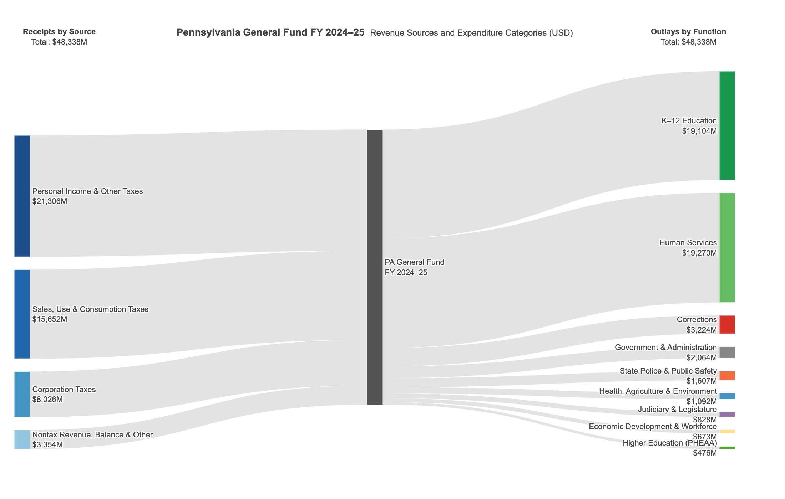

**Note:** I consulted an LLM to assist with assigning colors for plots throughout this data task, since I am colorblind.


## Paid Family Leave

**Context:**
The United States is the only OECD country lacking a national Paid Family Leave (PFL) program. In the absence of a federal policy, several states have implemented paid family leave programs. One of the earliest was New Jersey’s Family Leave Insurance (FLI) program, implemented in 2009, which provides eligible workers with up to six weeks of paid leave at a 66% wage replacement rate.

Eligibility for FLI is determined at the **household level** and depends on (i) sufficient labor force attachment of a designated adult household member (the "reference individual"), defined as **having worked at least 20 weeks in the prior year**, and (ii) the presence of a qualifying caregiving need (**e.g., a recent birth, a child less than one years old in the household, or caring for another household member with a disability**).

**Goal:**
Evaluate whether the introduction of New Jersey’s FLI program in 2009 improved the economic well-being of households most likely to be affected. New Jersey shares a labor market and economic environment with neighboring Pennsylvania within the Philadelphia Metropolitan Area, yet Pennsylvania did not implement a paid family leave policy during this period.

**Data:**
Individual-level cross-sectional American Community Survey (ACS) 1-Year PUMS data (via [IPUMS USA](https://usa.ipums.org/usa/)) for households in the Philadelphia Metropolitan Area from 2006–2012. A codebook describing all variables is included. Because the ACS is collected annually, variable definitions and coding may change
over time.




### Data Preprocessing

```{r}
#| label: setup
library(tidyverse)
library(readxl)
library(knitr)
library(kableExtra)
```

```{r}
#| label: load-data
nj_raw <- read_excel("data/nj.xlsx")
pa_raw <- read_excel("data/pa.xlsx")

# Merge dataframes
raw <- bind_rows(nj_raw, pa_raw)
```

```{r}
#| label: preprocess
#| cache: true
acs <- raw |>
    # Restrict to 2006-2012 according to task spec
    filter(year >= 2006, year <= 2012) |>
    # Reformat / reconcile variables where necessary
    mutate(
        # State code
        state = case_when(
            st == 34 ~ "New Jersey",
            st == 42 ~ "Pennsylvania",
            TRUE     ~ NA_character_
        ),

        # Reconcile relationship column name: PA uses 'relp', NJ uses 'rel'
        # bind_rows will have created both columns with NAs where missing
        rel = coalesce(rel, relp),

        # Reference individual (household-level) indicator
        is_ref_person = (rel == 0),

        # WAGP: Wages / salary income over the past 12 months
        # 2006–2007: -1 is the N/A encoding for under-15 year olds, replace with NA
        wagp = if_else(wagp == -1, NA_real_, wagp),

        # FS: Food stamp / SNAP recipiency
        # 2006–2007: dollar amount (0 = none, >0 = received)
        # 2008-2012: 1 = yes, 2 = no
        # Convert all years to standardized binary indicator
        fs_binary = case_when(
            year <= 2007 & fs > 0  ~ 1L,  # received (dollar amount)
            year <= 2007 & fs == 0 ~ 0L,  # did not receive
            year >= 2008 & fs == 1 ~ 1L,  # received
            year >= 2008 & fs == 2 ~ 0L,  # did not receive
            TRUE                   ~ NA_integer_
        ),

        # DS: Disability indicator
        # 0 is N/A encoding for under-3 or under-5 (depending on year), replace with NA
        # 1 = with a disability; 2 = without a disability.
        ds = na_if(ds, 0L),

        # WKW: Weeks worked over the past 12 months
        # 2006–2007: continuous (0 = N/A, 1–52 = actual weeks)
        # 2008-2012: 0 = N/A, 1=50–52, 2=48–49, 3=40–47, 4=27–39, 5=14–26, 6=<14 weeks
        # Recode the 2006–2007 continuous values into the 2008-2012 6 bins so all years are comparable.
        # Replace 0 code with NA.
        wkw_cat = case_when(
            # 2006–2007: recode continuous weeks → bins matching 2008+ scheme
            year <= 2007 & wkw == 0              ~ NA_integer_,
            year <= 2007 & between(wkw, 50, 52)  ~ 1L,
            year <= 2007 & between(wkw, 48, 49)  ~ 2L,
            year <= 2007 & between(wkw, 40, 47)  ~ 3L,
            year <= 2007 & between(wkw, 27, 39)  ~ 4L,
            year <= 2007 & between(wkw, 14, 26)  ~ 5L,
            year <= 2007 & between(wkw,  1, 13)  ~ 6L,
            # 2008-2012: already categorical; 0 = N/A
            year >= 2008 & wkw == 0              ~ NA_integer_,
            year >= 2008 & wkw %in% 1:6          ~ as.integer(wkw),
            TRUE                                 ~ NA_integer_
        ),

        # Formatted WKW label text for visualizations (using wkw_cat)
        wkw_label = factor(
            wkw_cat,
            levels = 1:6,
            labels = c("50–52 wks", "48–49 wks", "40–47 wks",
                       "27–39 wks", "14–26 wks", "<14 wks")
        ),

        # 20 weeks worked indicator (using wkw_cat)
        # Bins 1–4 are >= 27 weeks
        # Bin 5 is 14–26 weeks (ambiguous), replace with NA
        # Bin 6 is <14 weeks
        wkw_20plus = case_when(
            wkw_cat %in% 1:4 ~ TRUE,
            wkw_cat == 5     ~ NA,  # ambiguous, FLI eligibility threshold of 20 weeks
            wkw_cat == 6     ~ FALSE,
            TRUE             ~ NA
        ),

        # SCHL: Highest educational attainment
        # 2006–2007: 16 categories
        # 2008-2012: 24 categoryies (more granular K-12)
        # Recode into 5 ordered degree levels
        educ = case_when(
            # 2006–2007
            year <= 2007 & schl %in% 1:8   ~ "Less than HS diploma",
            year <= 2007 & schl == 9       ~ "HS diploma / GED",
            year <= 2007 & schl %in% 10:11 ~ "Some college",
            year <= 2007 & schl == 12      ~ "Associate's",
            year <= 2007 & schl == 13      ~ "Bachelor's",
            year <= 2007 & schl %in% 14:16 ~ "Graduate",
            # 2008-2012
            year >= 2008 & schl %in% 1:15  ~ "Less than HS diploma",
            year >= 2008 & schl %in% 16:17 ~ "HS diploma / GED",
            year >= 2008 & schl %in% 18:19 ~ "Some college",
            year >= 2008 & schl == 20      ~ "Associate's",
            year >= 2008 & schl == 21      ~ "Bachelor's",
            year >= 2008 & schl %in% 22:24 ~ "Graduate",
            TRUE                           ~ NA_character_
        ),
        educ = factor(
            educ, 
            levels = c("Less than HS diploma", "HS diploma / GED", "Some college",
                    "Associate's", "Bachelor's", "Graduate")
        ),

        # REL/RELP: Relationship to reference individual
        # 2006–2007: 13 categories
        # 2008-2012: 17 categories (more granular)
        # For simplicity, recode to reference individual, spouse, child, and other
        rel_simple = case_when(
            rel == 0                           ~ "Reference individual",
            rel == 1                           ~ "Spouse / partner",
            year <= 2007 & rel == 2            ~ "Child",  # 1 = son/daughter in 2006-2007
            year >= 2008 & rel %in% c(2, 3, 4) ~ "Child",  # bio/adopted/step resp. in 2008-2012
            TRUE                               ~ "Other"
        )
    )

# Check preprocessing
stopifnot(
    all(acs$state %in% c("New Jersey", "Pennsylvania")),
    all(acs$year %in% 2006:2012),
    all(is.na(acs$wkw_cat) | acs$wkw_cat %in% 1:6)
)
```


The raw data consists of individual-level ACS PUMS records for `r nrow(acs) |> scales::comma()` persons across `r n_distinct(acs$serialno) |> scales::comma()` unique households in the Philadelphia Metropolitan Area, including both New Jersey and Pennsylvania, spanning 2006 to 2012.

Several relevant variables required reformatting or reconciliation across survey years before pooling:

* **Weeks worked (WKW):** In 2006–2007, WKW is recorded as an exact week count (1–52), with 0 denoting non-workers.
From 2008 onward, the Census Bureau switched to a 6-category ordinal recode (1 = 50–52 weeks, . . . , 6 = fewer than 14 weeks), with 0 again denoting non-workers. 
We categorize the earlier continuous values into the same 6 bins so that all years are comparable. 
The zero code is treated as missing (`NA`) in all years, since it includes individuals not in the labour force, unemployed individuals, and those under 16 years old.
One consequence is of categorizing is that bin 5 (14–26 weeks worked in the past 12 months) straddles the FLI eligibility threshold of 20 weeks worked in the last year; observations in this bin are treated as having ambiguous eligibility status (binary indicator for FLI eligibility constructed in Section 3).

* **Food stamps / SNAP (FS):** In 2006–2007, FS records the dollar amount of benefits received (0 = none).
From 2008 onward, the variable is a binary recipiency flag (1 = yes, 2 = no). 
We reduce to a single binary indicator across all years.

* **Educational attainment (SCHL):** The coding scheme expanded from 16 to 24 categories in 2008, adding individual grade levels to the K–12 range.
We collapse both schemes into six  ordered degree levels (less than HS diploma, HS diploma/GED, some college, Associate's, Bachelor's, graduate) that are consistently defined under both schemes.

* **Disability (DS/DIS):** The variable was renamed from DS to DIS in 2008, with no change in encoding.
The value 0, used as an N/A sentinel for young children (under 5 in most years), is recoded to missing (`NA`).

* **Wages (WAGP):** In 2006–2007, non-workers and persons under 15 are encoded as −1 rather than missing. We replace −1 with `NA`.

* **Relationship (REL/RELP):** The variable was renamed from REL to RELP in 2008, with the category scheme expanding from 13 to 17 categories, primarily distinguishing biological, adopted, and stepchildren.
In the datasets, Pennsylvania uses `relp`, while New Jersey uses `rel`.
Thus, we reconcile them to all use `rel`.
For analyses requiring relationship status we use a simplified four-category recode (reference individual, spouse/partner, child, other) that is defined consistently across the full time frame.

Definitions for all variables are drawn from the official ACS PUMS Data Dictionaries for each year. Other relevant variables had either had stable encoding throughout 2006 to 2012 or had been previously reconciled.




### Distribution of Weeks Worked, by State and Year

```{r}
#| label: q2-note
# Unit of observation for WKW is the individual (not household).
# We restrict to 16+ years old individuals who worked at least one week
# (i.e., wkw_cat is non-missing), using individuals' sampling weights (pwgtp).
wkw_data <- acs |>
    filter(!is.na(wkw_cat), agep >= 16)
```

```{r}
#| label: tbl-wkw
#| tbl-cap: "Distribution of Weeks Worked in Past 12 Months by State and Year (weighted %)"

wkw_tab <- wkw_data |>
    group_by(state, year, wkw_label) |>
    summarise(n_wtd = sum(pwgtp), .groups = "drop") |>
    group_by(state, year) |>
    mutate(pct = round(100 * n_wtd / sum(n_wtd), 1)) |>
    ungroup() |>
    select(state, year, wkw_label, pct) |>
    pivot_wider(names_from = wkw_label, values_from = pct, values_fill = 0)

bind_rows(
    wkw_tab |> filter(state == "New Jersey") |> select(-state),
    wkw_tab |> filter(state == "Pennsylvania") |> select(-state)
) |>
    rename(Year = year) |>
    kbl(booktabs = TRUE, linesep = "") |>
    kable_styling(font_size = 9, latex_options = c("hold_position", "scale_down")) |>
    pack_rows("New Jersey", 1, 7) |>
    pack_rows("Pennsylvania", 8, 14) |>
    footnote(
        general = "ACS PUMS 1-Year data, 2006--2012, Philadelphia Metro Area. Individuals aged 16+ who worked at least one week. Individual sampling weights (pwgtp) applied. WKW recoded to 6-bin categorical for all years (continuous in 2006--2007 raw data).",
        threeparttable = TRUE
    )
```

```{r}
#| label: fig-wkw
#| fig-cap: "Weeks worked distribution by state and year (weighted, workers age 16+)"
#| fig-width: 8
#| fig-height: 5

# Colour palette for WKW bins
bin_colours <- c(
    "50–52 wks" = "#2166ac",
    "48–49 wks" = "#4393c3",
    "40–47 wks" = "#92c5de",
    "27–39 wks" = "#d1e5f0",
    "14–26 wks" = "#f4a442",
    "<14 wks"   = "#d6604d"
)

wkw_data |>
    group_by(state, year, wkw_label) |>
    summarise(n_wtd = sum(pwgtp), .groups = "drop") |>
    group_by(state, year) |>
    mutate(pct = 100 * n_wtd / sum(n_wtd)) |>
    ungroup() |>
    mutate(wkw_label = fct_rev(wkw_label)) |>   # stack full-year on top
    ggplot(aes(x = factor(year), y = pct, fill = wkw_label)) +
    geom_col(width = 0.8, colour = "white", linewidth = 0.2) +
    geom_vline(xintercept = 3.5,   # between 2007 and 2008 (WKW coding break)
                linetype = "dashed", colour = "black", linewidth = 0.5) +
    geom_vline(xintercept = 4.5,   # 2009: NJ FLI implemented
                linetype = "dotted", colour = "black", linewidth = 0.7) +
    annotate("text", x = 2.5, y = 104, label = "WKW\nrecoding", 
            hjust = 0, size = 2.3, colour = "black") +
    annotate("text", x = 4.55, y = 104, label = "FLI\nimplemented",
            hjust = 0, size = 2.3, colour = "black") +
    scale_fill_manual(values = bin_colours, name = "Weeks worked in\npast 12 months",
                        guide = guide_legend(reverse = TRUE)) +
    scale_y_continuous(labels = scales::label_percent(scale = 1),
                        expand = expansion(mult = c(0, 0.08))) +
    facet_wrap(~state, ncol = 2) +
    labs(
        x = "Survey Year",
        y = "Share of workers (weighted %)",
        caption = "Dashed line: WKW variable recoding break (2007 to 2008). Dotted line: NJ FLI implemented (2009).\nOrange bin (14–26 wks) straddles the FLI 20-week eligibility threshold."
    ) +
    theme_bw(base_size = 10) +
    theme(
        legend.position = "right",
        panel.grid.major.x = element_blank(),
        strip.text = element_text(face = "bold"),
        axis.text.x = element_text(angle = 45, hjust = 1),
        plot.caption = element_text(size = 7, colour = "grey40", hjust = 0)
    )
```

Because WKW is measured at the individual level, I use the ACS individual sampling weight (`pwgtp`) so that the reported percentages represent the population distribution of workers rather than the unweighted sample composition.


**Comments on distribution over time:**

```{r}
#| label: q2-stats
#| include: false

full_year_min <- min(wkw_tab$`50–52 wks`, na.rm = TRUE)
full_year_max <- max(wkw_tab$`50–52 wks`, na.rm = TRUE)

ambig_min <- min(wkw_tab$`14–26 wks`, na.rm = TRUE)
ambig_max <- max(wkw_tab$`14–26 wks`, na.rm = TRUE)

ambig_post <- wkw_data |>
  filter(year >= 2008) |>
  summarise(
    p = 100 * weighted.mean(wkw_cat == 5, pwgtp, na.rm = TRUE)
  ) |>
  pull(p)

pre_gap_full <- wkw_tab |>
  filter(year <= 2008) |>
  select(state, year, `50–52 wks`) |>
  pivot_wider(names_from = state, values_from = `50–52 wks`) |>
  mutate(gap = abs(`New Jersey` - `Pennsylvania`)) |>
  summarise(
    mean_gap = mean(gap),
    max_gap = max(gap)
  )

nj_full_0608 <- wkw_tab |>
  filter(state == "New Jersey", year %in% c(2006, 2007, 2008)) |>
  summarise(avg = mean(`50–52 wks`)) |>
  pull(avg)

pa_full_0608 <- wkw_tab |>
  filter(state == "Pennsylvania", year %in% c(2006, 2007, 2008)) |>
  summarise(avg = mean(`50–52 wks`)) |>
  pull(avg)
```

Among workers aged 16 and older who worked at least one week in the past year, the weeks-worked distribution is heavily concentrated in full-year employment. The 50–52 week bin accounts for between `r round(full_year_min, 1)`% and `r round(full_year_max, 1)`% of workers across all state-year cells.

The two states also look quite similar in the pre-policy period. From 2006 to 2008, the average share in the 50–52 week bin was `r round(nj_full_0608, 1)`% in New Jersey and `r round(pa_full_0608, 1)`% in Pennsylvania, and the average absolute gap between the two states in that bin was only `r round(pre_gap_full$mean_gap, 1)` percentage points (with a maximum pre-period gap of `r round(pre_gap_full$max_gap, 1)` points). This similarity is reassuring for the later New Jersey–Pennsylvania comparison.

At the same time, the 2007 to 2008 break should be interpreted cautiously. The underlying ACS variable changes from an exact week count to a six-bin categorical variable in 2008, so some visible movement around that date may reflect recoding rather than a true shift in labor supply.

The most important measurement issue for the later eligibility analysis is the 14–26 week bin. This group represents between `r round(ambig_min, 1)`% and `r round(ambig_max, 1)`% of workers across state-year cells, and an average of `r round(ambig_post, 1)`% of workers in 2008–2012. Because this bin straddles the 20-week FLI eligibility cutoff, these observations cannot be cleanly classified as eligible or ineligible based on weeks worked alone.




### FLI Eligibility Indicator and Household Income Trends

```{r}
#| label: q3-eligibility
#| include: false

hh <- acs |>
    # Compute household-level caregiving flags across all members
    group_by(serialno, state, year) |>
    mutate(
        has_infant          = any(agep == 0,           na.rm = TRUE),
        has_recent_birth    = any(fer == 1,            na.rm = TRUE),
        has_disabled_member = any(ds == 1 & rel != 0,  na.rm = TRUE),
        caregiving_need     = has_infant | has_recent_birth | has_disabled_member
    ) |>
    ungroup() |>
    # Keep only reference individual row for each household
    # Carries hincp, wgtp, wkw_20plus, and caregiving flags
    filter(is_ref_person, !is.na(hincp)) |>
    mutate(
        eligible = case_when(
            !is.na(wkw_20plus) & wkw_20plus  & caregiving_need  ~ TRUE,
            !is.na(wkw_20plus) & !wkw_20plus                    ~ FALSE,
            !is.na(caregiving_need) & !caregiving_need          ~ FALSE,
            TRUE                                                 ~ NA
        ),
        eligible_label = case_when(
            eligible == TRUE  ~ "Eligible",
            eligible == FALSE ~ "Not eligible",
            TRUE              ~ NA_character_
        )
    ) |>
    filter(!is.na(eligible))

# Binary indicator results
hh |>
    count(state, eligible_label) |>
    pivot_wider(names_from = eligible_label, values_from = n)
```

```{r}
#| label: q3-income-trend
# Weighted mean household income by state * year * eligibility
income_trend <- hh |>
    group_by(state, year, eligible_label) |>
    summarise(
        mean_hincp = weighted.mean(hincp, wgtp, na.rm = TRUE),
        # Weighted SE for ribbon: sqrt(weighted variance / eff. N)
        wt_var = 
            sum(wgtp * (hincp - weighted.mean(hincp, wgtp))^2, na.rm = TRUE) / sum(wgtp),
        n = n(),
        .groups = "drop"
    ) |>
    mutate(
        se_hincp = sqrt(wt_var / n),
        ci_lo = mean_hincp - 1.96 * se_hincp,
        ci_hi = mean_hincp + 1.96 * se_hincp
    )
```

```{r}
#| label: fig-income-trend-nj
#| fig-cap: "Mean household income over time by FLI eligibility status, New Jersey (2006–2012)"
#| fig-width: 6
#| fig-height: 4
elig_colours <- c("Eligible" = "#d73027", "Not eligible" = "steelblue")

plot_income <- function(st_name) {
    income_trend |>
        filter(state == st_name) |>
        ggplot(aes(x = year, y = mean_hincp / 1000,
                   colour = eligible_label, group = eligible_label)) +
        geom_ribbon(aes(ymin = ci_lo / 1000, ymax = ci_hi / 1000,
                        fill = eligible_label),
                    alpha = 0.12, colour = NA) +
        geom_line() +
        geom_point(size = 2) +
        geom_vline(xintercept = 2009, linetype = "dashed",
                   colour = "black", linewidth = 0.6) +
        annotate("text", x = 2009.1, y = Inf, label = "FLI implemented",
                 hjust = 0, vjust = 1.5, size = 3, colour = "black") +
        scale_x_continuous(breaks = 2006:2012) +
        scale_y_continuous(labels = scales::label_dollar(suffix = "k")) +
        scale_colour_manual(values = elig_colours, name = NULL) +
        scale_fill_manual(values = elig_colours, name = NULL) +
        labs(
            title = st_name,
            x = "Survey year",
            y = "Mean household income (nominal USD)"
        ) +
        theme_bw(base_size = 10) +
        theme(
            legend.position = "bottom",
            strip.text = element_text(face = "bold"),
            panel.grid.minor = element_blank(),
            plot.title = element_text(face = "bold")
        )
}

plot_income("New Jersey")
```

```{r}
#| label: fig-income-trend-pa
#| fig-cap: "Mean household income over time by FLI eligibility status, Pennsylvania (2006–2012)"
#| fig-width: 6
#| fig-height: 4

plot_income("Pennsylvania")
```

Household sampling weights (`wgtp`) applied. Shaded bands show 95% confidence intervals.
FLI eligibility defined as: (i) reference individual worked at least 27 weeks AND (ii) 
household has an infant, recent birth, or disabled non-reference member. Households where 
the reference individual worked 14–26 weeks are excluded.


**Construction of the eligibility indicator:** 
A household is coded as plausibly eligible for New Jersey's FLI if (i) the reference individual worked at least 20 weeks in the prior year (`wkw_20plus == TRUE`) and (ii) any household member is under one year old (`agep == 0`), gave birth in the past year (`fer == 1`), or any non-reference member has a disability (`ds == 1`).

The first condition was implemented as an indicator for WKW bins 1–4, corresponding to at least 27 weeks worked. Households whose reference individual falls in the 14–26 week bin are excluded from the eligible/ineligible comparison rather than risking misclassification of ambiguous data points.
Household income (`hincp`) and the eligibility indicator are measured at the household level using the household sampling weight (`wgtp`).


**a. Can the figure be interpreted as evidence of causal effects?**

The figure alone cannot by itself be interpreted as evidence of causal effects of New Jersey FLI's policy, for a couple reasons:

* Eligible and ineligible households differ systematically by definition: eligible households have an infant, recent birth, or disabled member.
Since household income is a net value (can be negative) and thus reflects spending, the income gap between the groups may be reflecting the difference between these demographics rather than the effect of the policy.

* Causal inference requires comparing the change in the eligible–ineligible income gap after 2009 in NJ relative to the same change in PA (difference-in-differences).
A simple before/after comparison within NJ alone confounds FLI with anything else that changed in 2009.




### FLI Policy Effect on Household Income 

```{r}
#| label: q4-setup
library(lmtest)
library(sandwich)
library(modelsummary)
```

```{r}
#| label: q4-regression
reg_data <- hh |>
    mutate(
        nj = as.integer(state == "New Jersey"),
        post = as.integer(year >= 2009),
        log_hincp = if_else(hincp > 0, log(hincp), NA_real_)
    )

mod_levels <- lm(
    hincp ~ eligible * nj * post + factor(year),
    data = reg_data,
    weights = wgtp
)

mod_log <- lm(
    log_hincp ~ eligible * nj * post + factor(year),
    data = reg_data |> filter(!is.na(log_hincp)),
    weights = wgtp
)
```

```{r}
#| label: tbl-did
#| tbl-cap: "Effect of NJ FLI on Household Income"
coef_map <- c(
    "eligibleTRUE"         = "Eligible",
    "nj"                   = "New Jersey",
    "post"                 = "Post (2009+)",
    "eligibleTRUE:nj"      = "Eligible $\\times$ NJ",
    "eligibleTRUE:post"    = "Eligible $\\times$ Post",
    "nj:post"              = "NJ $\\times$ Post",
    "eligibleTRUE:nj:post" = "Eligible $\\times$ NJ $\\times$ Post"
)

modelsummary(
    list("(1) Levels" = mod_levels, "(2) Log income" = mod_log),
    coef_map = coef_map,
    stars = c("*" = 0.1, "**" = 0.05, "***" = 0.01),
    fmt = 2,
    escape = FALSE,
    gof_map = tribble(
        ~raw,         ~clean,          ~fmt,
        "nobs",       "Observations",  0,
        "r.squared",  "$R^2$",         3
    ),
    notes = list(
        "Household sampling weights (wgtp) applied.",
        "Standard errors in parentheses.",
        "Year fixed effects included in regression but not shown above.",
        "Log specification drops households with non-positive income.",
        "Post = (survey year >= 2009)."
    ),
    output = "kableExtra"
) |>
    kable_styling(latex_options = c("hold_position", "scale_down"), font_size = 9) |>
    add_header_above(c(" " = 1, "Dependent variable: Household income" = 2))
```

**Regression equations:** 
Both specifications estimate a difference-in-differences-in-differences (triple difference) model.
Let $\text{Eligible}_i$ indicate whether household $i$ meets the FLI eligibility criteria, $\text{NJ}_i$ indicate New Jersey, and $\text{Post}_t = I\{t \geq 2009\}$.
Year fixed effects $\lambda_t$ absorb economy-wide changes common to all households.
The two specifications are:

$$
Y_{it} = \beta_0 + \beta_1 \text{Eligible}_i + \beta_2 \text{NJ}_i + \beta_3 \text{Post}_t
+ \beta_4 (\text{Eligible} \times \text{NJ})_i + \beta_5 (\text{Eligible} \times \text{Post})_{it}
$$
$$+ \beta_6 (\text{NJ} \times \text{Post})_{it}
+ \beta_7\,(\text{Eligible} \times \text{NJ} \times \text{Post})_{it}
+ \lambda_t + \varepsilon_{it}
$$

where $Y_{it}$ is either household income in dollars (specification 1) or log household income  (specification 2).
The coefficient of interest is $\delta$, which captures the income change for eligible NJ households after FLI was implemented in 2009, relative to eligible PA households and ineligible households in both states (the three control groups).


**Interpretation of results:**
In the levels specification, $\hat{\beta_7} = \$3{,}591$, and in the log specification, $\hat{\beta_7} = 0.06$ (roughly a 6% income increase). However, neither estimate is statistically distinguishable from zero. Both have large standard errors relative to the point estimate, so we cannot rule out that the true effect is zero.

Several other coefficients are significant but reflect pre-existing differences rather than the policy.
The large negative coefficient on Eligible ($-\$8{,}055$) reflects that eligible households (those with infants, recent births, or disabled members) tend to have lower incomes than ineligible households regardless of the policy. This reflects our earlier concern from Question 3 that the eligible and ineligible household differ systematically, and that differences in household income may be a result of those differences.
The positive Post coefficient (\$12,264) reflects income growth common to all households after 2009, possibly related to economic recovery following the 2008 Recession. Regardless, these are not effects of FLI.

In short, the regression finds no statistically significant effect of New Jersey's FLI program on household income for eligible households, relative to the control groups (eligible PA households and ineligible households in both states).
However, this null result should be interpreted cautiously. The pre-treatment period spans only three years, the eligible group is relatively small, and ambiguity in the weeks worked data means some genuinely eligible households are excluded from the analysis. These factors all reduce our ability to detect an effect if one exists.


**Levels or log:** Given the context, the log specification is more appropriate:

* Household income is generally right-skewed. 
A small number of very high-income households can pull the levels estimate away from what is typical for most families.
The log transformation reduces this and gives a result more representative of the average household.

* A percentage-change interpretation fits the policy better.
Since FLI replaces 66%  of prior wages, the benefit scales with earnings.
Thus, a proportional effect is more plausible than a fixed dollar effect across all income levels.

The cost of using the log is dropping households with zero or negative income.
However, these households fewer than `r round(100 * sum(reg_data$hincp <= 0) / nrow(reg_data), 2)`% of the sample.




### Incomplete Take-Up Effect on FLI Eligibility as a Treatment

**Effect of incomplete take-up:**
When eligibility is used as the treatment variable, the regression estimates the average income change for households that were eligible for FLI, regardless of whether they actually took the leave.
If only a fraction of eligible households take up the benefit, the regression coefficients will understate the effect on households that actually used it.
In practice, the estimated $\hat{\beta}_7$ would have averaged over takers (who may have experienced a real income effect) and non-takers (who experienced nothing compared to the control), pulling the estimate of the FLI policy income effect towards zero.


**Empirical strategy:**
If data on actual take-up were available, the use of instrumental variables could recover the effect of actually taking leave on household income. Eligibility would serve as the instrument for take-up: 

1. First, we can regress an indicator for whether the household took FLI leave on eligibility (and the
other DiD terms).

2. Then, we can use the predicted take-up from the first stage in place of actual take-up as the regressor for household income.

This estimate would recover the income effect of taking leave for households whose take-up was caused by their eligibility (local average treatment effect).


**Required assumptions:**
The requirements for the use of such an instrumental variable are as follows:

1. **Exclusion restriction:**
Eligibility affects household income only through its effect on take-up, and not through any other channel.

2. **Relevance:**
Eligibility must actually increase the probability of taking leave.

3. **Monotonicity:**
Eligibility does not cause any household to take less leave than they otherwise would have.

Monotonicity is satisfied by construction in this context, since ineligible households cannot take FLI leave at all.




## Sankey Diagram Exercise

**Task:**
Produce a Sankey diagram representing the budget inflows and outflows of the state of Pennsylvania.

Specifically, please construct a Sankey diagram that illustrates the flow of Pennsylvania’s state budget from revenue sources to expenditure categories for a recent fiscal year.
You may use publicly available Pennsylvania state budget documents, revenue reports, or summary tables as your data sources.
Your diagram should not separately display every line item of receipts and outlays. Rather, like the example above, it should aggregate them into sensible and informatively named categories, such as personal income tax, sales tax, corporate tax (for revenues) and education, health and social services, transportation (for outlays).


### Data Sourcing
The data for this diagram were obtained from the **FY 2024-25 Governor's Executive Budget** 
("Budget in Brief"), published by the [Pennsylvania Office of the Budget](https://www.pa.gov/agencies/budget/publications-and-reports/commonwealth-budget). 
All figures are drawn from two summary tables in that document, as described below.


**Revenue:**
Revenue figures come from the **Seven Year Financial Statement** (p. 29), **2024-25 Budget** column. 
The statement reports four revenue line items: Corporation Taxes ($8,026M), Consumption Taxes ($15,652M), Other Taxes ($21,306M), and Nontax Revenue ($1,291M).
Several adjustments are required to make total inflows balance to total planned expenditures ($48,338M):

1. Net current-year revenues ($44,848M after deducting refunds of $1,428M) fall short of planned expenditures, so the state is drawing down $3,624M of its accumulated beginning balance ($7,070M) to fund the gap (a planned use of prior-year surplus).
Pennsylvania's General Fund is constitutionally required to be  balanced, so there is no deficit branch analogous to the federal example. 

2. Prior-year lapses ($250M) represent unspent appropriations returned to the fund.
These three items -- nontax revenue, balance drawdown, lapses, net of refunds -- are combined into a single composite node, "Nontax Revenue, Balance & Other" ($3,354M), ensuring  total inflows equal total expenditures at $48,338M.


**Expenditures:** 
Figures come from the **Department Funding Summary** (p. 28), *General Fund* column.
This column captures the core discretionary and formula-driven state appropriations, excluding Motor License Fund (constitutionally restricted to highways), Lottery Fund (restricted to senior services), Federal Funds, and other restricted accounts, each of which has its own dedicated revenue stream and 
is reported separately in the Budget in Brief.
Thus, using only the General Fund column produces a sufficient snapshot of how Pennsylvania allocates its revenues.

The 40+ department line items were aggregated into nine functional categories. 
The aggregation prioritizes two goals: preserving the identity of the two dominant categories in the original data, and grouping the remaining smaller departments by policy function.

* **K–12 Education ($19,104M):** The Department of Education alone, kept separate since it constitutes 40% of General Fund expenditures. The Basic Education Funding formula and special education are its primary components.
  
* **Human Services ($19,270M):** The Department of Human Services alone, kept separate for the same reason as Education. Medicaid (Medical Assistance), intellectual disabilities waivers, and cash assistance programs are its primary components.

* **Corrections ($3,224M):** Kept separate from other public safety because its scale ($3.2B) is large enough for its own node, and its function are distinct from law enforcement.

* **State Police & Public Safety ($1,607M):** State Police ($1,208M), Pennsylvania Commission on Crime and Delinquency ($244M), and Attorney General ($155M) are grouped together as a law enforcement and criminal justice category.

* **General Government & Administration ($2,064M):** Treasury, Revenue, Executive Offices, General Services, Legislature-adjacent agencies, and other administrative departments that provide general government services.

* **Health, Agriculture & Environment ($1,092M):** Department of Health, Department of Agriculture, Department of Environmental Protection, Department of Conservation and Natural Resources, Department of Drug and Alcohol Programs, Emergency Management Agency, and Historical and Museum Commission.

* **Economic Development & Workforce ($673M):** Department of Community and Economic Development, Department of Labor and Industry, Department of Military and Veterans Affairs, and the Transportation General Fund appropriation (most transportation spending flows through Motor License Fund, not General Fund).

* **Higher Education via PHEAA ($476M):** The Pennsylvania Higher Education Assistance Agency is kept separate from K–12 Education because it serves a distinct policy function (student financial aid and institutions).

* **Judiciary & Legislature ($828M):** Judiciary ($454M) and Legislature ($374M).

These nine categories sum to $48.338B, matching the General Fund total reported 
in the Seven Year Financial Statement.




### Visualization

```{r}
#| label: fig-sankey
#| fig-cap: "Pennsylvania General Fund FY 2024–25: Revenue Sources and Expenditure Categories (USD)"
#| fig-align: center
#| out-width: "100%"


```

The diagram was built in R using `plotly`'s built-in Sankey trace and exported to PNG via `webshot2`. The structure mirrors the U.S. Treasury reference: a single central node ("PA General Fund FY 2024–25") connects four revenue source nodes on the left to nine expenditure category nodes on the right, with flow widths proportional to dollar amounts.

One structural difference from the federal example is the absence of a deficit node. Pennsylvania's budget is constitutionally required to be balanced; the planned drawdown of beginning-balance surplus ($3,624M) is absorbed into the "Nontax Revenue, Balance & Other" revenue node rather than shown as a 
borrowing flow.